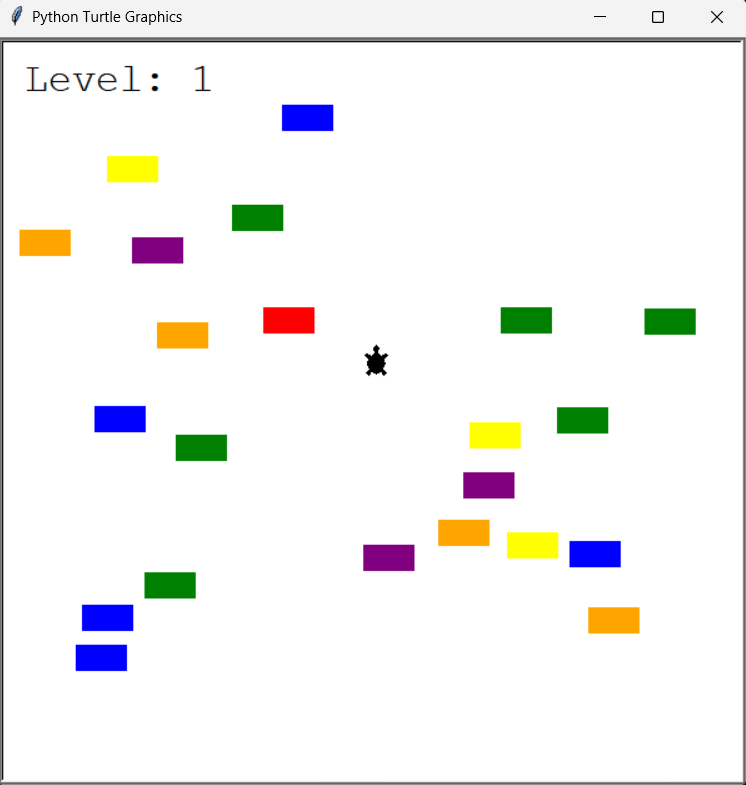
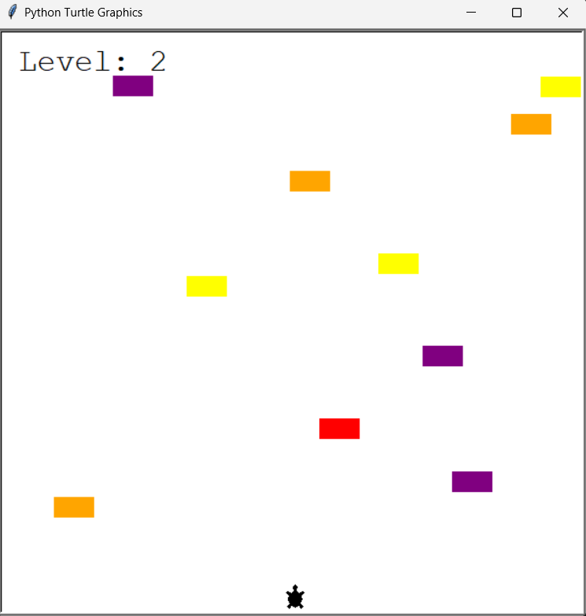
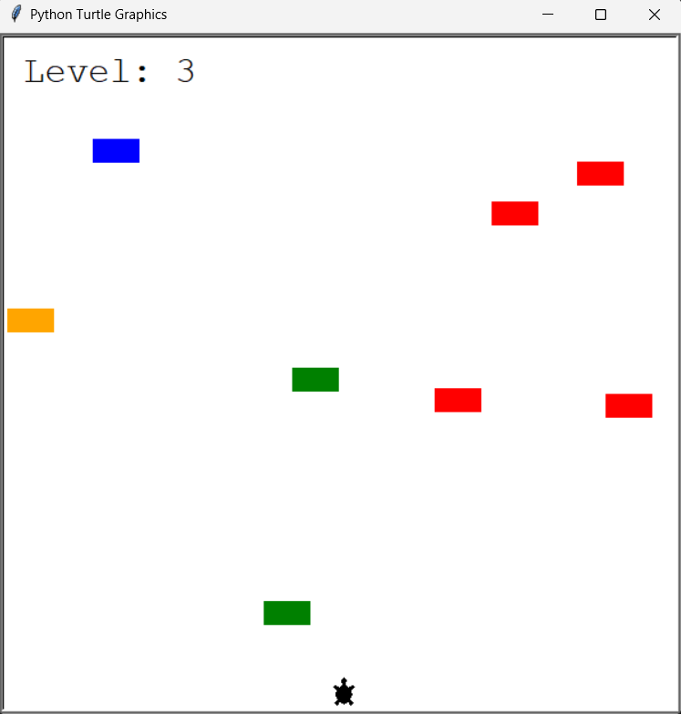

# 🐢 Turtle Traffic Dodger Project
A fast paced arcade style game built with Python’s `turtle` graphics library, where players navigate a turtle through relentless waves of traffic, testing their reflexes and precision.

---

## 📖 Overview  
The **Turtle Traffic Dodger Project** is a Python based interactive game designed to simulate the thrill of navigating through an unpredictable and high speed traffic environment. Developed using the `turtle` graphics module, this project merges **core programming principles** with **creative problem solving** to create a fun yet technically insightful experience.  

At its core, the player controls a turtle that must **strategically dodge moving cars** while progressing upward across the screen. As levels advance, the gameplay intensifies: cars accelerate, spawn density increases, and the difficulty curve grows sharper, demanding quick decision making and flawless timing.  

This project not only demonstrates the **practical application of OOP (Object Oriented Programming)** in Python but also introduces concepts such as **event driven programming**, **modular design**, and **dynamic difficulty scaling**. It emphasizes how fundamental programming concepts can be combined to build visually interactive and challenging applications. And it's an excellent example of how python libraries can be leveraged to create polished, engaging, and replayable games while reinforcing computer science fundamentals.

---

## ⚙️ Technologies and Concepts Used  

This project demonstrates a practical blend of Python fundamentals and intermediate programming concepts, specifically tailored to building interactive games using the **Turtle Graphics** library. Below are the key technologies and concepts leveraged:  

- 🐍 **Python 3**: Core programming language used to implement the entire project logic.  
- 🐢 **Turtle Graphics Module**: Utilized to create the game’s visual environment, player controlled turtle, and moving traffic cars.  
- 🧮 **Object Oriented Programming (OOP)**:  
  - Classes and objects encapsulate player, car, and game mechanics.  
  - Inheritance and modular design improve reusability and scalability.  
- 🔄 **Event Handling**: Keybindings (`onkeypress`) allow the player to control the turtle character seamlessly.  
- ⏱️ **Game Loop Logic**: A continuous loop structure is used to update car movement, collision checks, and game progress.  
- 🎮 **Collision Detection**: Algorithmic logic to identify overlaps between the turtle and cars for accurate game over scenarios.  
- 📏 **Level Progression System**:  
  - Increasing car speed with each completed level.  
  - Enhanced difficulty curve to ensure challenging yet engaging gameplay.  
- 🧩 **Modular Code Architecture**: Each functionality (player, car manager, scoreboard) is isolated into separate modules for clarity, maintainability, and scalability.  
- 🖥️ **Clean UI/UX with Turtle**: Designed to mimic a retro arcade feel using simple yet effective visuals.  

> ✅ *This project is not only a fun gaming experience but also an excellent case study for strengthening Python OOP, event driven programming, and modular design principles.*  

---

## 🕹️ Gameplay Mechanics  

The **Turtle Traffic Dodger** project is designed with immersive mechanics that balance simplicity, challenge, and progression. The key gameplay elements are outlined below:  

- 🎮 **Controls :**  
  - `⬆️ Up Arrow` → Move the turtle forward by one step.  

- 👤 **Player Control**  
  - The user controls a turtle character that moves **vertically upward** using keyboard input.  
  - Input handling ensures responsiveness, making gameplay smooth and interactive.  

- 🚗 **Dynamic Traffic System**  
  - Cars are randomly generated and move **horizontally** across the screen.  
  - Direction, speed, and spawn frequency create unpredictable traffic flow, adding to the challenge.  

- 💥 **Collision Mechanics**  
  - The game constantly checks for overlaps between the turtle and traffic objects.  
  - On collision, the game terminates with a "Game Over" message, ensuring fair and immediate feedback.  

- 🏆 **Progression & Levels**  
  - Each time the player successfully reaches the top of the screen, they complete a level.  
  - With every new level:  
    - Car speed is increased.  
    - Difficulty rises, demanding sharper reflexes and precise timing.  

- 📊 **Scoring & Feedback System**  
  - The scoreboard displays the **current level**, acting as both progress tracking and motivation.  
  - Clear textual feedback reinforces progression and outcomes (Level Up / Game Over).  

- ⏳ **Replayability Factor**  
  - Progressive difficulty ensures that no two playthroughs feel the same.  
  - Balances accessibility for beginners with challenging mechanics for advanced players.  

> 🎯 *Every aspect of the gameplay is engineered to deliver an engaging arcade-style experience while reinforcing computational thinking and real-world programming concepts.*  

---

## 📂 Project Structure

```
turtle-traffic-dodger-project/
│
├── main.py # Entry point – initializes and runs the main game loop and integrates all modules
├── player.py # Player class – manages turtle creation, movement, and collision detection
├── car_manager.py # CarManager class – handles car generation, movement, and dynamic difficulty scaling
├── scoreboard.py # Scoreboard class – tracks levels, displays score, and shows Game Over messages
└── README.md # Documentation – provides detailed project overview, setup guide, and technical insights
```

---

### 🚀 How to Run

> ⚠️ Ensure you have **Python 3.10+** installed.

### Prerequisites
- Python 3.10 or above
- Compatible terminal or IDE (e.g., VS Code, PyCharm)

1. Install the required dependencies (if not already present):
   ```bash
   pip install turtle
   ```

2. **Clone the repository**
   ```bash
   git clone https://github.com/your-username/turtle-traffic-dodger-project.git
   ```

3. **Navigate to the project folder**
   ```bash
   cd turtle-traffic-dodger-project
   ```

> 💡 **Optional – Windows Only:** If you encounter errors related to `TCL_LIBRARY` or `TK_LIBRARY`, ensure that your Python installation's Tcl paths are correctly set using `os.environ` at the beginning of your script:
   ```bash
   import os
   os.environ['TCL_LIBRARY'] = r'C:\Program Files\Python313\tcl\tcl8.6'
   os.environ['TK_LIBRARY'] = r'C:\Program Files\Python313\tcl\tk8.6'
   ```

4. **Run the script**
   ```bash
   python main.py
   ```

---

## 🎮 Sample Output  

The game unfolds in stages, each level introducing **new challenges and higher intensity**. With every progression:  
- 🚗 The **number of cars** increases, crowding the road  
- ⚡ The **speed of cars** accelerates, demanding sharper reflexes  
- 🏆 Survival becomes harder, but more rewarding  

This creates a **progressive difficulty curve** where the thrill never fades – instead, it grows with every level.  

---

### 📸 Gameplay Previews  

#### 🔹 Level 1 – Beginner Stage  
At the start, the player faces **fewer cars** at a **slower pace**, making it easier to adapt to the controls.  
✨ Perfect for warming up and getting comfortable with the mechanics before the real chaos begins!  
  

---

#### 🔹 Level 2 – Intermediate Challenge  
With progression, **more cars spawn** and **move faster**, demanding quicker reactions and careful timing.  
⚡ The action feels more alive as the player starts dodging cars at greater speed.  
  

---

#### 🔹 Level 3 – Advanced Difficulty  
At higher levels, cars appear **frequently and at lightning speeds**, pushing the player’s focus and reflexes to the absolute limit.  
🔥 Only the most alert players can survive these upcoming stages of rapid chaos.  
  

---

> 🚀 **In summary:** As the levels climb, both the **speed** and the **number of cars** scale up dramatically, delivering a thrilling, fast-paced, and progressively tougher gameplay experience.

---

## ✨ Key Highlights  

- **🎮 Engaging Arcade-Style Gameplay** – Offers a thrilling reflex-based experience where the player must guide a turtle safely across a bustling roadway. The balance of **progressive speed increases** and **dynamic car spawning** ensures a fresh challenge every time.  

- **📈 Progressive Difficulty Scaling** – Each successful crossing elevates the difficulty: cars move faster, spawn more frequently, and demand sharper reflexes. This adaptive curve guarantees that gameplay remains exciting, competitive, and rewarding over time.  

- **⚡ Optimized Rendering & Responsiveness** – Built using Python’s `turtle` graphics module, the game loop is carefully tuned with frame delays and optimized update cycles, delivering **fluid animations** and **lag-free responsiveness** even as complexity increases.  

- **🛠 Modular & Maintainable Architecture** – Cleanly separated into dedicated modules:  
  - `player.py` – Manages turtle movement and boundary logic.  
  - `car_manager.py` – Controls vehicle creation, positioning, and velocity scaling.  
  - `scoreboard.py` – Handles level tracking, user feedback, and game-over display.  
  - `main.py` – The central orchestration hub that integrates all game components.  
  This structured design simplifies debugging, enhances scalability, and makes the project easier to extend with new features.  

- **🎯 Advanced Collision & Success Mechanics** – Implements precise collision detection between the player and vehicles, immediate game termination upon impact, and robust **finish-line recognition** that rewards successful crossings with progression.  

- **🎨 Minimalist but Functional UI** – Clear level indicators, a simple game-over message, and a focused visual design maintain immersion while emphasizing core gameplay without unnecessary distractions.  

- **🖥 Cross-Platform Portability** – Designed for Windows, macOS, and Linux environments with Python 3.x. Requires no external dependencies, making it lightweight and effortless to run on any system.  

---

## 📜 Credits  

This project was developed as part of my learning journey through **“100 Days of Code: The Complete Python Pro Bootcamp” by Dr. Angela Yu**. The course provided the foundational concepts and guided exercises, while I extended the implementation into a **fully modular and scalable arcade-style game**.  

- 👨‍💻 **Development & Implementation** – Designed, coded, and optimized all mechanics including **player movement**, **vehicle management**, and **dynamic difficulty scaling**.  
- 📂 **Project Architecture** – Organized into a clean, multi-file structure (`player.py`, `car_manager.py`, `scoreboard.py`, `main.py`) for clarity, maintainability, and professional code practices.  
- 🧩 **Enhancements Beyond Core Learning** – Added structured documentation, detailed README, refined collision handling, and scalable difficulty mechanics to elevate the project beyond a simple exercise into a polished showcase.  
- 🐢 **Graphics & Engine** – Powered entirely by Python’s `turtle` graphics library, proving its versatility in building interactive, visually appealing applications.  

> This project not only reflects the progress made during the course but also demonstrates an ability to **translate foundational programming concepts into a professional, real-world styled project**.  

---